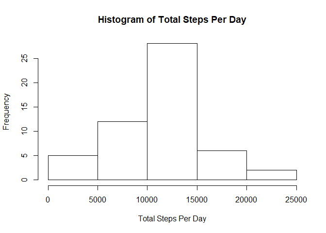
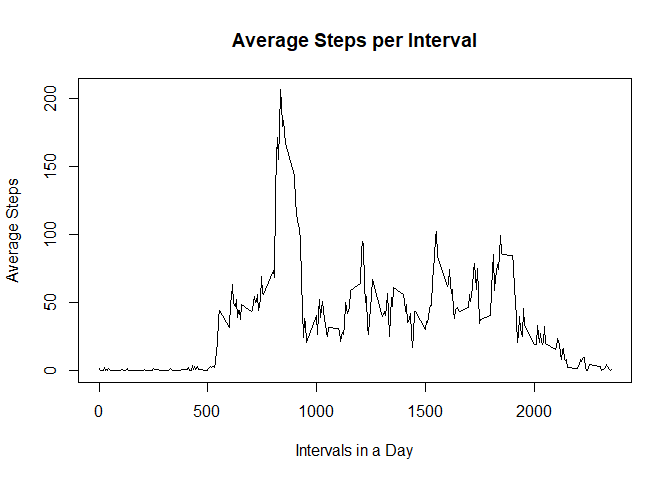
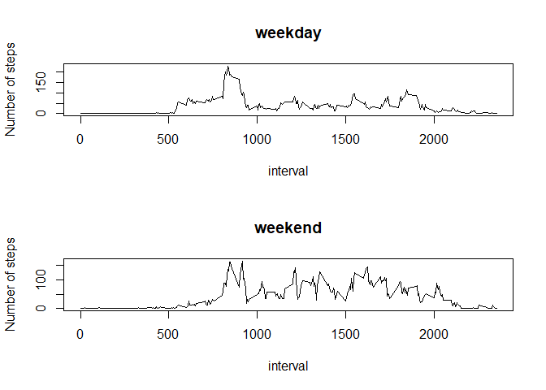

github repo for rest of specialization: [Data Science
Coursera](https://github.com/RicardoDeGouveia/DataScienceCoursera)

Introduction
------------

It is now possible to collect a large amount of data about personal
movement using activity monitoring devices such as a Fitbit, Nike
Fuelband, or Jawbone Up. These type of devices are part of the
“quantified self” movement – a group of enthusiasts who take
measurements about themselves regularly to improve their health, to find
patterns in their behavior, or because they are tech geeks. But these
data remain under-utilized both because the raw data are hard to obtain
and there is a lack of statistical methods and software for processing
and interpreting the data.

This assignment makes use of data from a personal activity monitoring
device. This device collects data at 5 minute intervals through out the
day. The data consists of two months of data from an anonymous
individual collected during the months of October and November, 2012 and
include the number of steps taken in 5 minute intervals each day.

The data for this assignment can be downloaded from the course web site:

-   Dataset: [Activity monitoring
    data](https://d396qusza40orc.cloudfront.net/repdata%2Fdata%2Factivity.zip)

The variables included in this dataset are:

steps: Number of steps taking in a 5-minute interval (missing values are
coded as 𝙽𝙰) </br> date: The date on which the measurement was taken in
YYYY-MM-DD format </br> interval: Identifier for the 5-minute interval
in which measurement was taken </br> The dataset is stored in a
comma-separated-value (CSV) file and there are a total of 17,568
observations in this dataset.

Loading and preprocessing the data
----------------------------------

Unzip data to obtain a csv file.

``` r
library("data.table")
```

    ## Warning: package 'data.table' was built under R version 3.6.3

``` r
library(ggplot2)
```

    ## Warning: package 'ggplot2' was built under R version 3.6.3

``` r
fileUrl <- "https://d396qusza40orc.cloudfront.net/repdata%2Fdata%2Factivity.zip"
download.file(fileUrl, destfile = paste0(getwd(), '/repdata%2Fdata%2Factivity.zip'), method = "curl")
unzip("repdata%2Fdata%2Factivity.zip",exdir = "data")
```

Reading csv
-----------

``` r
rawData<-read.csv("activity.csv")
stripNA<-rawData[!is.na(rawData$steps),]
```

What is mean total number of steps taken per day?
-------------------------------------------------

1.  Calculate the total number of steps taken per day

``` r
# Calculate the total number of steps taken per day
totalStepsPerDay<-aggregate(stripNA$steps, by=list(date=stripNA$date), FUN=sum)
head(totalStepsPerDay)
```

    ##         date     x
    ## 1 2012-10-02   126
    ## 2 2012-10-03 11352
    ## 3 2012-10-04 12116
    ## 4 2012-10-05 13294
    ## 5 2012-10-06 15420
    ## 6 2012-10-07 11015

1.  If you do not understand the difference between a histogram and a
    barplot, research the difference between them. Make a histogram of
    the total number of steps taken each day.

``` r
# Create a histogram of no of steps per day
hist(totalStepsPerDay$x,xlab="Total Steps Per Day", main="Histogram of Total Steps Per Day")
```



1.  Calculate and report the mean and median of the total number of
    steps taken per day

``` r
# Calculate the mean and median of the total number of steps taken per day
summary(totalStepsPerDay$x)
```

    ##    Min. 1st Qu.  Median    Mean 3rd Qu.    Max. 
    ##      41    8841   10765   10766   13294   21194

What is the average daily activity pattern?
-------------------------------------------

1.  Make a time series plot (i.e. 𝚝𝚢𝚙𝚎 = “𝚕”) of the 5-minute interval
    (x-axis) and the average number of steps taken, averaged across all
    days (y-axis)

``` r
avgStepPerInterval<-aggregate(stripNA$steps, by=list(interval=stripNA$interval), FUN=mean)

with(avgStepPerInterval, plot(interval, x, main = "Average Steps per Interval", xlab="Intervals in a Day", ylab="Average Steps", type="l"))
```



1.  Which 5-minute interval, on average across all the days in the
    dataset, contains the maximum number of steps?

``` r
# Identify the interval index which has the highest average steps
avgStepPerInterval[avgStepPerInterval$x==max(avgStepPerInterval$x),]
```

    ##     interval        x
    ## 104      835 206.1698

Imputing missing values
-----------------------

1.  Calculate and report the total number of missing values in the
    dataset (i.e. the total number of rows with 𝙽𝙰s)

``` r
# Calculate and report the total number of missing values in the dataset (i.e. the total number of rows with NAs).
missValues<-rawData[is.na(rawData$steps),]
nrow(missValues)
```

    ## [1] 2304

1.  Devise a strategy for filling in all of the missing values in the
    dataset. The strategy does not need to be sophisticated. For
    example, you could use the mean/median for that day, or the mean for
    that 5-minute interval, etc.

``` r
print("Here I use the mean of 5-minute interval to fill in the values of the missing values.")
```

    ## [1] "Here I use the mean of 5-minute interval to fill in the values of the missing values."

1.  Create a new dataset that is equal to the original dataset but with
    the missing data filled in.

``` r
fillNA<- function(rawData, avgStepPerInterval)
{
  newData<-rawData
    for(i in 1:nrow(newData))
    {
       if(is.na(newData[i,"steps"]))
       {
          interval<-newData[i,"interval"]
          newData[i,"steps"] = avgStepPerInterval[ which(avgStepPerInterval$interval==interval),"x"]
       }
    }
    newData
}

newData<-fillNA(rawData,avgStepPerInterval)
head(newData)
```

    ##       steps       date interval
    ## 1 1.7169811 2012-10-01        0
    ## 2 0.3396226 2012-10-01        5
    ## 3 0.1320755 2012-10-01       10
    ## 4 0.1509434 2012-10-01       15
    ## 5 0.0754717 2012-10-01       20
    ## 6 2.0943396 2012-10-01       25

1.  Make a histogram of the total number of steps taken each day and
    calculate and report the mean and median total number of steps taken
    per day. Do these values differ from the estimates from the first
    part of the assignment? What is the impact of imputing missing data
    on the estimates of the total daily number of steps?

``` r
newTotalPerDay<-aggregate(newData$steps, by=list(date=newData$date), FUN=sum)
head(newTotalPerDay)
```

    ##         date        x
    ## 1 2012-10-01 10766.19
    ## 2 2012-10-02   126.00
    ## 3 2012-10-03 11352.00
    ## 4 2012-10-04 12116.00
    ## 5 2012-10-05 13294.00
    ## 6 2012-10-06 15420.00

``` r
# Compute the mean and median of the imputed value
# Calculate the mean and median of the total number of steps taken per day
summary(newTotalPerDay$x)
```

    ##    Min. 1st Qu.  Median    Mean 3rd Qu.    Max. 
    ##      41    9819   10766   10766   12811   21194

| Type of Estimate                       | Mean\_Steps | Median\_Steps |
|----------------------------------------|-------------|---------------|
| First Part (with na)                   | 10765       | 10765         |
| Second Part (fillin in na with median) | 9354.23     | 10395         |

Are there differences in activity patterns between weekdays and weekends?
-------------------------------------------------------------------------

1.  Create a new factor variable in the dataset with two levels –
    “weekday” and “weekend” indicating whether a given date is a weekday
    or weekend day.

``` r
Sys.setlocale("LC_TIME", "English")
```

    ## [1] "English_United States.1252"

``` r
weekdays1 <- c('Monday', 'Tuesday', 'Wednesday', 'Thursday', 'Friday')
newData$date<-as.Date(newData$date)
newData$wDay <- factor((weekdays(newData$date) %in% weekdays1),levels=c(FALSE, TRUE), labels=c('weekend', 'weekday')) 

head(newData)
```

    ##       steps       date interval    wDay
    ## 1 1.7169811 2012-10-01        0 weekday
    ## 2 0.3396226 2012-10-01        5 weekday
    ## 3 0.1320755 2012-10-01       10 weekday
    ## 4 0.1509434 2012-10-01       15 weekday
    ## 5 0.0754717 2012-10-01       20 weekday
    ## 6 2.0943396 2012-10-01       25 weekday

1.  Make a panel plot containing a time series plot (i.e. 𝚝𝚢𝚙𝚎 = “𝚕”) of
    the 5-minute interval (x-axis) and the average number of steps
    taken, averaged across all weekday days or weekend days (y-axis).
    See the README file in the GitHub repository to see an example of
    what this plot should look like using simulated data.

``` r
weekDayData <- newData[ which(newData$wDay=='weekday'), ]
weekendData <- newData[ which(newData$wDay=='weekend'), ]

avgWeekDay<-aggregate(weekDayData$steps, by=list(interval=weekDayData$interval), FUN=mean)

avgWeekend<-aggregate(weekendData$steps, by=list(interval=weekendData$interval), FUN=mean)

par(mfrow = c(2, 1))

plot(avgWeekDay$interval, avgWeekDay$x, main = "weekday", xlab="interval", ylab="Number of steps", type="l")
plot(avgWeekend$interval, avgWeekend$x, main = "weekend", xlab="interval", ylab="Number of steps", type="l")
```


